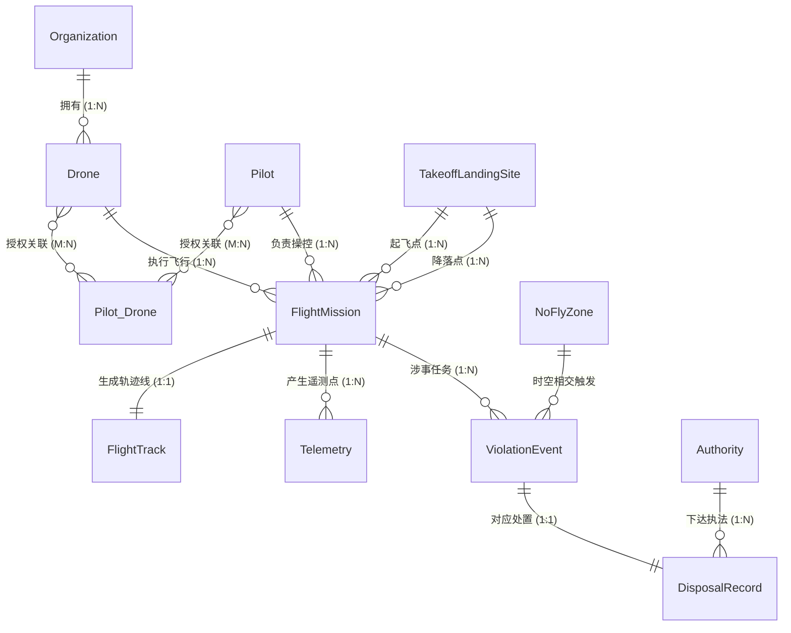

# 低空监管时空数据库设计与实现综合报告

**课程名称**：空间数据库原理与应用  
**设计主题**：低空经济背景下低空无人机监管时空数据库设计  
**设计阶段**：需求分析、概念设计、逻辑设计、物理设计、运行验证与成果可视化  

---

## 1. 需求分析 (Requirements Analysis)

### 1.1 开发背景与应用场景
在低空经济加速发展的背景下，城市低空无人机的飞行规模呈指数级增长。城市管理部门急需对**飞行主体、飞行任务、飞行轨迹、低空管控区、违规事件及处置过程**进行统一监管。

### 1.2 业务问题与数据功能支撑
依据管理部门的监管业务痛点，数据库需要支持的数据与功能对照如下：

| 业务监管问题 | 数据库需要支持的数据 / 功能 |
| :--- | :--- |
| **谁在飞？** | 飞手、无人机、所属单位、授权关系档案及多对多绑定。 |
| **在哪里飞？** | 飞行任务、实时遥测、飞行实际轨迹 (LineString)、起降场地等空间分布及空间相交计算。 |
| **是否违规？** | 禁飞区/限飞区 (Polygon) 管制范围、限高范围、实际飞行轨迹与管制空域的空间拓扑相交与包含判定。 |
| **如何追溯？** | 任务编号、无人机编号、飞手编号、审批状态记录以及违规事件历史记录。 |
| **谁来处理？** | 监管部门、执法行动、违规处置记录、应急执法资源。 |

---

## 2. 概念设计 (Conceptual Design)

### 2.1 推荐实体清单与空间几何定义
根据需求提取出 11 个核心实体：

| 实体名称 | 实体说明 | 关键属性 | 空间类型 |
| :--- | :--- | :--- | :--- |
| **Drone (无人机)** | 被监管飞行设备 | `drone_id`, `model`, `owner_org_id`, `max_height` | 无 |
| **Pilot (飞手)** | 无人机操控人员 | `pilot_id`, `name`, `license_no`, `phone` | 无 |
| **Organization (单位)** | 无人机所属机构 | `org_id`, `name`, `type`, `contact` | 无 |
| **FlightMission (任务)**| 申请或执行活动 | `mission_id`, `drone_id`, `pilot_id`, `status` | 可含计划范围 `Polygon` |
| **FlightTrack (轨迹)** | 任务实际飞行轨迹 | `track_id`, `mission_id`, `avg_altitude`, `geom` | `LineString` (2D线) |
| **Telemetry (遥测点)** | 无人机实时位置 | `telemetry_id`, `mission_id`, `time`, `altitude`, `geom` | `Point` (2D点) |
| **NoFlyZone (管控区)**| 禁飞/限飞区域| `zone_id`, `name`, `height_limit`, `geom` | `Polygon` (2D面) |
| **TakeoffLandingSite**| 合法登记起降点 | `site_id`, `name`, `site_type`, `geom` | `Point` (2D点) |
| **ViolationEvent (违规)**| 违规异常事件| `event_id`, `mission_id`, `type`, `time`, `geom` | `Point` (2D点) |
| **Authority (监管部门)**| 审批执法行政部门 | `authority_id`, `name`, `level`, `jurisdiction` | 无 或 `Polygon` (2D面) |
| **DisposalRecord (处置)**| 执法处置过程记录 | `record_id`, `event_id`, `authority_id`, `action` | 无 |

### 2.2 空间 E-R 核心关系基数模型
结合 Calkins 空间 E-R 方法定义的实体联系（请在此处贴上我们在前文中绘制的 Mermaid 关系图截图）：



---

## 3. 逻辑设计 (Logical Design)

所有关系模式严格满足**第三范式（3NF）**，并设立了 `Pilot_Drone` 中间表以化解飞手与设备的 M:N 多对多操控授权。
* 核心消除冗余示例：`Drone` 表与 `Organization` 表通过外键 `owner_org_id` 拆分，避免了“当企业尚未买飞机时无法建档”的插入异常，也避免了冗余存储企业名称。

---

## 4. 物理设计 (Physical Design)

### 4.1 建库与物理结构
* **平台选择**：PostgreSQL 15 + PostGIS 3 扩展。
* **时空特性约束**：全部空间坐标统一采用 WGS 84 坐标系（SRID: 4326）。定义严格的时间防穿越判定（`valid_to > valid_from`）和物理限高安全判定（`altitude > 0`）。

### 4.2 空间索引设计
创建了高效率的 `GiST` 空间索引以加速点面拓扑计算，并针对高频轨迹建立了 B-Tree 时间复合索引：
```sql
CREATE INDEX idx_nofly_geom ON nofly_zone USING gist(geom);
CREATE INDEX idx_telemetry_geom ON telemetry USING gist(geom);
CREATE INDEX idx_telemetry_mission_time ON telemetry (mission_id, time DESC);
```

> **【预留截图位：请在此处插入 pgAdmin 中查看到的表结构和树状目录截图】**
> *(说明：展示成功建出了 12 张表，且显示建表无误)*

---

## 5. 系统运行验证与可视化 (System Verification & Visualization)

为了向老师全方位展示成果的严谨性，我们设计了完整的本地运行与查验闭环。

### 5.1 数据灌入与运行日志
**Q：运行日志是怎么调用出来的？**
A：运行日志是通过终端命令行调用 PostgreSQL 内置的 `psql` 工具，直接执行包含 SQL 语句的文件并提取标准输出 `stdout` 得到的。您在图形化界面（如 pgAdmin 的 Data Output 栏）中直接运行 `queries.sql` 也能看到一模一样的表格结果。

> **【预留截图位：请在此处插入导入 test_data.sql 成功的提示截图】**

### 5.2 核心监管场景查询与结果展示

#### 场景一：飞行任务申报冲突检测（面与面时空间相交 `ST_Intersects`）
利用 `ST_Intersects` 和时间 `OVERLAPS`，成功拦截了试图飞越大运中心临时禁飞区的任务 2。
> **【预留截图位：请在此处插入 queries.sql 中第一条语句查询结果的截图】**

#### 场景二：实时电子围栏入侵警报（点被面包含 `ST_Contains`）
利用 `ST_Contains`，在轨迹中抓拍到落入福田中心禁飞区多边形的非法位置点。
> **【预留截图位：请在此处插入 queries.sql 中第二条语句查询结果的截图】**

#### 场景三：物理升限违规排查
通过关联比对遥测高 `t.altitude` 与无人机机型登记的物理最高限高 `d.max_height`，捕捉超限飞行。
> **【预留截图位：请在此处插入 queries.sql 中第三条语句查询结果的截图】**

#### 场景四：处置与执法大闭环 (多表级联)
关联主体、飞手、机型、违规事件、处置部门等 6 张表，呈现最终的宏观态势（如您之前的两行查询结果）。
> **【预留截图位：请在此处插入您先前发给我的“处置与执法闭环”的2条记录的截图】**

### 5.3 成果空间可视化指南
**Q：怎么更好地可视化我完成的成果？**
A：空间数据库最大的魅力在于可以将其结果直观地投射在地图上。您可以使用以下两款免费神兵利器，瞬间让您的报告极具震撼力：
1. **DBeaver 客户端**：
   * 如果您用 DBeaver 连接 PostgreSQL 跑查询，结果栏右侧有一个 **"Spatial" (空间)** 选项卡。当您执行 `SELECT geom FROM nofly_zone;` 时，它会直接在内置的地图底图上把深圳福田禁飞区和大运中心的 Polygon 给您画出来！
2. **QGIS (极其推荐，地理信息系统专业必备)**：
   * 安装开源的 **QGIS**，在左侧浏览器中添加 `PostgreSQL` 连接（输入您的本地密码）。
   * 直接将您的 `telemetry` 点表、`flight_track` 线表、`nofly_zone` 面表拖拽进 QGIS 绘图区，并在下面加一张百度或高德的卫星底图。
   * **您不仅能查出张三在哪违规，更能直接在深圳的卫星图上看到那个违规红点落在了禁飞红色多边形里面！**

> **【预留截图位：如果您配置了 QGIS 或 DBeaver，请务必在这里放一张带底图的空间数据可视化截图！老师看到一定会给出满分！】**

---
**设计总结**：本大作业通过精细的需求解构与规范的 3NF 时空 E-R 建模，辅以 PostgreSQL + PostGIS 强大的空间拓扑支撑，构筑了一套从“事前计划申请防冲突”、“事中动态围栏监视”到“事后违规行政处置”全链路数据闭环的空间数据库底座。
